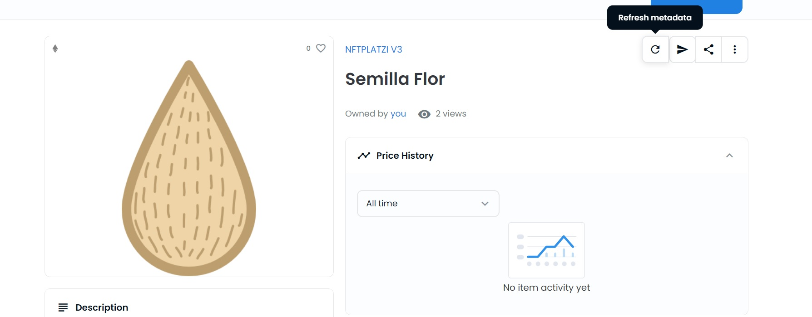

# Let's learn to create dynamic NFTs

## Contact 

If you have any question, contact here: [Telegram](https://t.me/shiny0103) | [Twitter](https://x.com/0xTan1319)

## Challenge 1

We are going to learn to create dynamic NFTs, which means they can change their metadata depending on certain conditions that we define.

To achieve this, we need to connect to tools that provide us with information to automate our smart contract. In this case, we are going to use some Chainlink services.

The steps you should follow are:

1. You must upload the images of the metadata that you want to change for the NFT to an IPFS network. You can use [Pinata](https://www.pinata.cloud/)
2. In Remix you must deploy the smart contract. For this you need tokens for the Rinkeby test network, which you can request from this [faucet](https://www.pinata.cloud/)
3. We must validate that our smart contract was deployed correctly on [Rinkeby](https://rinkeby.etherscan.io/) and that we can view our NFT in the test environment of [OpenSea](https://testnets.opensea.io/)
4. We are going to create on the Chainlink page that element that will allow us to automate the change of our NFT's metadata. For this we must enter the [keeper](https://keepers.chain.link) page
5. We select the "register new upkeep" option
6. Next we select "Custom-logic"
7. We must enter the address of the smart contract that we deployed in Remix
8. We enter the following values: Upkeep name, Gas limit: 200000, Starting balance (LINK): 5, Your email address
9. We approve the transaction and wait for it to be processed for the Chainlink network.
10. Now we can see how our NFT will change metadata depending on the time we have established when deploying the contract and it will be the one that executes the Chainlink keeper.
11. To validate that the metadata of our NFT is effectively changing, we can use the tokenURI functions that allow us to know what metadata a certain NFT has or the flowerStage function that returns a number between 0-2 and we could see how it increments.
12. If you want to visualize how your NFT's metadata changes on OpenSea, you have to enter the collection you created, enter the first element and in the upper right corner select the update metadata option, finally you must refresh the window to see the changes.

## Challenge 2

1. Modify the original code from the repository to allow your NFT to have 5 metadata changes.
2. Deploy the modified contract
3. Create a new time-based automation as executed in step 1.

## Challenge 3 (Optional)

1. Create a graphical interface with React that allows uploading the image, name, description, and characteristics of the NFT and that takes care of generating the JSON metadata file and uploading it to the IPFS network of your preference
2. Deploy the smart contract.
3. Perform functionality tests

## Resources

* [What is Chainlink](https://chainlinkspanishcommunity.medium.com/qu%C3%A9-es-chainlink-6ea80f9ff95e)
* [Chainlink Documentation](https://docs.chain.link/docs)

